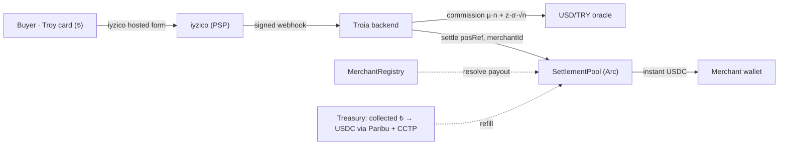

# Troia — built on Arc

**Cross-border stablecoin settlement rail.** A user pays in Turkish Lira with a domestic **Troy card**; the merchant is settled **instantly in USDC** on Arc from a pre-funded pool. The FX spread is the revenue. **Crypto is invisible to the end user.**

> Turkey has ~90M Troy cards (₺4.8T/yr) that **stop at the border**. PayPal left Turkey in 2016; Wise blocks Turkish *receiving*. Troia turns the domestic card into a global one — pay ₺, settle USDC on Arc, in seconds.

## ✅ Live on Arc testnet

| | |
|---|---|
| **SettlementPool** | [`0x7c9848396392A8BE58900fa56960cd8eC1782410`](https://testnet.arcscan.app/address/0x7c9848396392A8BE58900fa56960cd8eC1782410) |
| **MerchantRegistry** | [`0x0cEcd6aDf6f4227700B97CCA9372AB7072a15E53`](https://testnet.arcscan.app/address/0x0cEcd6aDf6f4227700B97CCA9372AB7072a15E53) |
| **Example settle tx** | [`0xd7926788…aedb5e`](https://testnet.arcscan.app/tx/0xd7926788dfa13333bde9060eadc3c2e8db0594a9a5f481333938023893aedb5e) — signed webhook → commission → on-chain USDC to merchant |
| Network | Arc Testnet · chainId `5042002` · USDC `0x3600…0000` (6-dec ERC-20 / native gas) · explorer `testnet.arcscan.app` |

The full path runs live: a **signed PSP webhook** → **live FX commission** → **on-chain `settle`** paying the merchant USDC, returning a real `txHash`.

## Model A — merchants integrate, payouts are verified on-chain

The checkout page carries only a **`merchantId`**, never a raw address. `SettlementPool.settle(posRef, merchantId, …)` resolves the payout from an on-chain **`MerchantRegistry`** — so a malicious/compromised page can **never** redirect funds.



**Two loops** decouple speed from FX: the merchant is paid **instantly** from the pool (loop 1); collected TRY refills the pool later via a licensed exchange + **CCTP** (loop 2). The pool carries the *n*-day FX risk that the commission prices.

**Commission** = `μ·n (drift) + z·σ·√n (volatility) + funding + margin`, with μ,σ from the **live USD/TRY series** — cheap in calm markets, higher when volatile. Short valör (T+1) lands **below banks' hidden spread**.

## Repo

```
src/               Solidity — MerchantRegistry.sol, SettlementPool.sol, mocks/
script/Deploy.s.sol  Arc deploy
test/              Foundry tests (11/11)
backend/           Node — commission engine, USD/TRY oracle, iyzico (IYZWSv2), chain (settle), HTTP server (8/8 tests)
extension/         Chrome MV3 — "Troia — built on Arc" (popup, content, background, icons)
web/               Design demos — checkout.html, store.html, extension-preview.html
```

## Run

```bash
# contracts
forge test -vv                       # 11/11
USDC_ADDR=0x3600000000000000000000000000000000000000 \
  forge script script/Deploy.s.sol --rpc-url arc_testnet --private-key <PK> --broadcast

# backend
cd backend && npm install
cp .env.example .env                 # fill iyzico + deployed addresses + OPERATOR_PK
node --test                          # 8/8
node --env-file=.env src/server.js   # :3000  → /quote, /pos/webhook, /onboard, /health

# extension
# chrome://extensions → Developer mode → Load unpacked → select extension/
```

## Circle stack on Arc

USDC (settlement + gas) · **CCTP / Bridge Kit** (treasury refill, cross-border USDC → Arc) · **Circle Wallets** (per-merchant payout wallets at onboarding) · **App Kits** (embedded fee = the merchant take-rate). Roadmap: on-chain TRY via **BRIX iTRY** bridged to Arc; production PSP partnership (iyzico / Paribu).

## Security

Payouts route only to registry-verified merchants · reentrancy guard · pause · per-tx circuit breaker (`maxSettleAmount`) · replay guard (`posRef`) · two-step ownership · webhook HMAC verified fail-closed & timing-safe · secrets only in gitignored `.env`.

---
*Not financial advice. The fiat leg runs on a licensed PSP; Troia is the settlement/software layer. Testnet only. Arc is a trademark of Circle Internet Group, Inc.*
