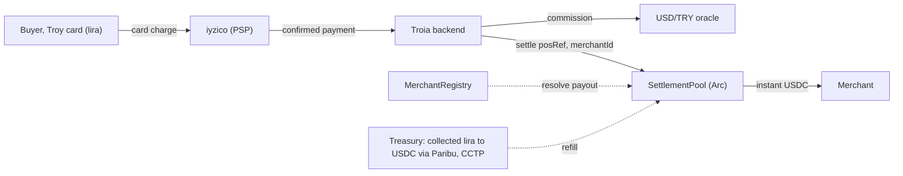

# Troia

Built on Arc.

Troia lets someone in Turkey pay a "pay with crypto" checkout with an ordinary Troy card. The shopper never holds crypto. Troia charges the card in lira through a licensed payment provider (iyzico), then settles the merchant in USDC on Arc. The FX spread is the business.

There are roughly 90 million Troy cards in Turkey and about ₺4.8 trillion of yearly volume, and nearly all of it stops at the border. PayPal left Turkey in 2016, and Wise still blocks Turkish accounts from receiving. Troia turns that domestic card into a way to pay merchants abroad: the buyer pays lira, the merchant receives USDC on Arc, in seconds.

## The flow

A merchant runs a normal web2 store. At checkout the shopper can pay by card, PayPal, or crypto. If they pick crypto, the store shows a network (Arc, Arbitrum, Ethereum, Avalanche) and a deposit address, exactly like any crypto checkout. The store never mentions Troia.

The Troia browser extension notices that checkout and adds one option, "pay with your Troy card." From there the shopper does two things:

1. Pastes the deposit address the store showed. That is the on-chain destination.
2. Enters the Troy card, which iyzico charges in lira.

Troia takes the lira and settles the merchant in USDC on Arc. No wallet, no seed phrase, no gas for the buyer.

## Live on Arc testnet

| Contract | Address |
|---|---|
| SettlementPool | [`0x7c9848396392A8BE58900fa56960cd8eC1782410`](https://testnet.arcscan.app/address/0x7c9848396392A8BE58900fa56960cd8eC1782410) |
| MerchantRegistry | [`0x0cEcd6aDf6f4227700B97CCA9372AB7072a15E53`](https://testnet.arcscan.app/address/0x0cEcd6aDf6f4227700B97CCA9372AB7072a15E53) |

Network: Arc testnet, chainId `5042002`, USDC `0x3600…0000` (6-decimal ERC-20, native gas), explorer `testnet.arcscan.app`.

A real payment runs the whole path. iyzico charges the card in the sandbox (it shows up as a successful transaction in the merchant dashboard), the backend prices the FX commission from a live USD/TRY series, and `SettlementPool.settle` pays the merchant USDC and returns a transaction hash.

## Payouts are verified on-chain (Model A)

The checkout only ever carries a `merchantId`, never a raw wallet address. `SettlementPool.settle(posRef, merchantId, …)` looks up the payout address from an on-chain `MerchantRegistry`, so a tampered or compromised page cannot redirect funds anywhere.



Two loops keep speed apart from FX risk. The merchant is paid instantly from the pool (loop 1). The lira Troia collected refills the pool later through a licensed exchange and CCTP (loop 2). The pool carries the n-day FX risk that the commission prices in.

## Commission

`commission(n) = drift + volatility + funding + margin`, where drift is `mu*n`, volatility is `z*sigma*sqrt(n)`, and mu, sigma come from the live USD/TRY series. It is cheap when the market is calm and higher when it is volatile. A short settlement window (T+1) lands under the spread banks hide in their own rate.

## Repo

```
src/                 Solidity: MerchantRegistry.sol, SettlementPool.sol, mocks/
script/Deploy.s.sol  Arc deploy
test/                Foundry tests (11/11)
backend/             Node: commission engine, USD/TRY oracle, iyzico (IYZWSv2),
                     chain settle, HTTP server (routes: /quote, /pay/card, /demo/pay,
                     /pay/init, /pay/callback, /onboard, /pos/webhook, /health)
extension/           Chrome MV3: two-step pay overlay, content, popup, background, icons
web/                 Demo store (PS5 catalog, web2 checkout) and preview pages
```

## Run

```bash
# contracts
forge test -vv
USDC_ADDR=0x3600000000000000000000000000000000000000 \
  forge script script/Deploy.s.sol --rpc-url arc_testnet --private-key <PK> --broadcast

# backend
cd backend && npm install
cp .env.example .env          # fill iyzico sandbox keys, deployed addresses, OPERATOR_PK
node --test
node src/server.js            # :3000, serves the demo store and the API

# extension
# chrome://extensions, turn on Developer mode, Load unpacked, pick extension/
```

Open `http://localhost:3000`, add a game to the cart, choose "pay with crypto", pick a network, then "pay with your Troy card." In the sandbox use iyzico's test card `5528 7900 0000 0008`, expiry `12/30`, CVV `123`.

## Circle on Arc

USDC for settlement and gas. CCTP for the treasury refill (moving collected value into USDC on Arc). Circle Wallets for per-merchant payout wallets at onboarding. App Kits carry the merchant take rate as an embedded fee. On the roadmap: on-chain lira via BRIX iTRY bridged to Arc, and a production PSP partnership (iyzico, Paribu).

## Security

Payouts only reach registry-verified merchants. Reentrancy guard, pause switch, a per-transaction circuit breaker (`maxSettleAmount`), a replay guard on `posRef`, and two-step ownership. Webhook signatures are checked fail-closed and in constant time. The demo settle route is off unless a build explicitly enables it, and onboarding needs an operator token. Secrets live only in a gitignored `.env`.

## Notes

Not financial advice. The fiat leg runs on a licensed PSP; Troia is the settlement and software layer. Testnet only. Arc is a trademark of Circle Internet Group, Inc.
